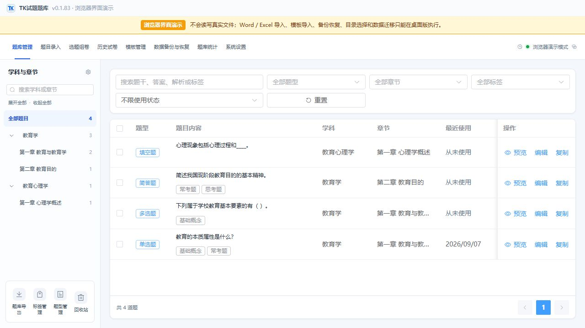
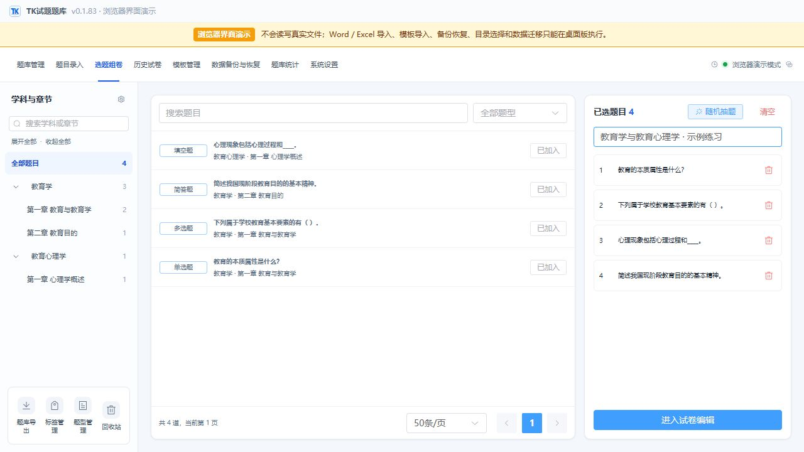
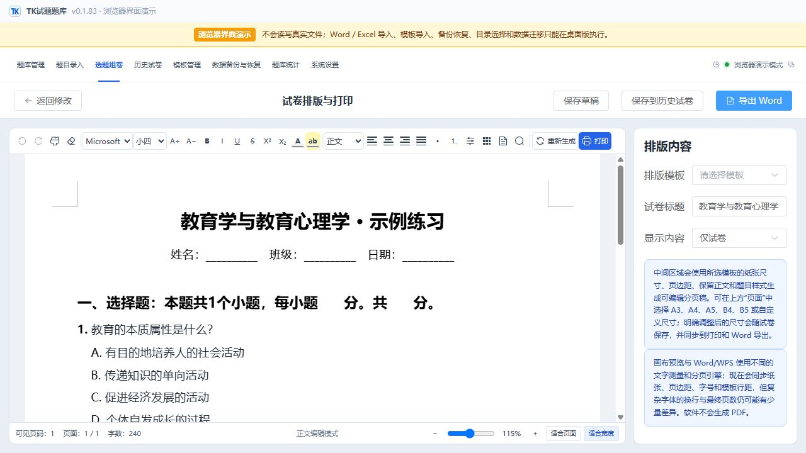

<p align="center">
  
</p>

# BCTK · TK Question Bank

**Build a local question bank from your teaching materials, then turn it into reusable exam papers.**

[中文](README.md) · English

BCTK (TK试题题库) is a Windows desktop application for teachers and educational organizations. It brings question editing, classification, paper assembly, page layout, and backup into one workflow. Question data is stored locally in SQLite; everyday local features work offline.

Built with **Tauri 2, Vue 3, TypeScript, Rust, and SQLite**. Source code is available under the **MIT License**. The current application interface is in Chinese.

**[Download for Windows](https://github.com/BBkjdayup/BCTK/releases/tag/v0.1.83)** · [Run from source](#run-from-source) · [Report an issue](https://github.com/BBkjdayup/BCTK/issues)

> The v0.1.83 application retains its existing trial and product licensing logic: a 15-day professional trial, a 15-day grace period, and a limited basic mode afterward. The MIT source license does not automatically change these runtime checks. See [licensing and scope](#licensing-and-scope).

## Screenshots



<details>
<summary><strong>Paper assembly and page layout</strong></summary>





</details>

These are actual screenshots of the v0.1.83 browser demo with built-in sample questions. The demo does not access real question-bank files; import, export, backup, and other filesystem operations require the desktop application.

## Features

| Workflow | Capabilities |
| --- | --- |
| Capture questions | Multiple question types, answers and explanations, rich text, images, tables, and math formulas |
| Organize a collection | Subjects, chapters, tags, search, filters, batch editing, and duplicate checks |
| Import materials | Word `.docx` and Excel `.xlsx`, with per-question review and duplicate handling |
| Assemble papers | Manual selection, filtered random selection, question replacement, and reordering |
| Prepare output | Paginated editing, templates, saved layouts, Word export, and system printing |
| Keep work reusable | Drafts, paper history, question snapshots, statistics, recycle bin, and `.tqb` backups |

Feature availability in the application depends on its existing license state. Word documents are read and generated by local Rust modules without automating Microsoft Office, WPS Office, or LibreOffice.

Complex documents have compatibility limits: nested tables, externally linked images, and some formula/OOXML content are not supported for Word export. Excel import uses saved cell values without calculating formulas and does not import floating images. See the [file compatibility details](README.md#文件兼容说明).

## Install on Windows

1. Open the [v0.1.83 release](https://github.com/BBkjdayup/BCTK/releases/tag/v0.1.83).
2. Download `BCTK_0.1.83_windows_x64-setup.exe` from **Assets**.
3. Follow the Chinese installation wizard and launch **TK试题题库**.

The installer targets **Windows 10 / 11 x64** and installs for the current Windows user. It may download WebView2 if the runtime is missing. GitHub's automatic **Source code** archives are not desktop installers.

This release distributes the existing v0.1.83 installer. Its SHA-256 and updater signature were checked. It has no Windows Authenticode signature and may appear as an unknown publisher. The release includes `SHA256SUMS.txt`; see the [release notes](docs/releases/v0.1.83.md) for provenance and limitations.

## Run from source

For the browser demo, install Node.js (24.x recommended) and pnpm 11.19.0. The desktop application additionally requires Rust stable with the MSVC toolchain, Visual Studio 2022 Build Tools with the C++ desktop workload, and WebView2.

```powershell
git clone https://github.com/BBkjdayup/BCTK.git
cd BCTK
npm install --global pnpm@11.19.0
pnpm install --frozen-lockfile

# Browser interface demo with sample data
pnpm dev

# Native desktop application; run separately
pnpm tauri dev
```

Build a Windows installer:

```powershell
pnpm build:installer
```

Output: `src-tauri/target/release/bundle/nsis/`.

This command disables generation of updater signing artifacts so the official private key is not required to build. It retains the application's identifiers, licensing logic, and update endpoints. Before distributing a modified application independently, configure your own identifiers, service URLs, and update keys. See [open-source build notes](docs/open-source.md).

## Development checks

```powershell
pnpm version:check
pnpm check
pnpm build

cargo fmt --all --manifest-path src-tauri/Cargo.toml -- --check
cargo test --locked --manifest-path src-tauri/Cargo.toml --lib -- --test-threads=1
cargo clippy --locked --manifest-path src-tauri/Cargo.toml --all-targets -- -D warnings
```

Automated checks do not replace installation, printing, document compatibility, and backup/restore testing on Windows.

## Architecture

- **Vue 3 / Element Plus / Pinia:** interface and application state in `src/`.
- **Tauri 2 / Rust / SQLite:** desktop integration, local data, and document processing in `src-tauri/`.
- **Tiptap / KaTeX:** rich question editing and formula rendering.
- **canvas-editor:** paginated paper editing and printing.
- **`website/`:** the separate product website, not a hosted question-bank application.

See the [Chinese documentation index](README.md#文档导航) for architecture, cloud sync, installation, and release details.

## Licensing and scope

Original source code is licensed under [MIT](LICENSE). Third-party components retain their own terms; see [THIRD_PARTY_NOTICES.md](THIRD_PARTY_NOTICES.md).

The current application retains its original product behavior. After the 15-day trial and 15-day grace period, basic mode allows browsing, search, manual single-question editing, classification, backup, restore, and migration. Papers are limited to 10 questions; batch import, document export, and printing are disabled.

Local question-bank features require neither a cloud account nor a database server. Cloud sync requires a compatible service and account permissions; the standalone cloud backend is not included in this repository. User question banks, deployment credentials, and private signing keys are also excluded.

## Contribute

Useful contributions include reproducible import/export examples, formula and table fixes, teaching workflow feedback, tests, and clearer documentation. Please read [CONTRIBUTING.md](CONTRIBUTING.md), or open an [issue](https://github.com/BBkjdayup/BCTK/issues). Use [SECURITY.md](SECURITY.md) for security reports.

If BCTK is useful to you, a **Star** helps you find it again and shows your interest in the project.
