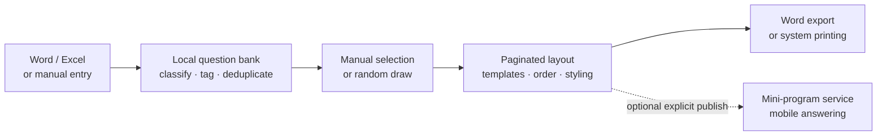
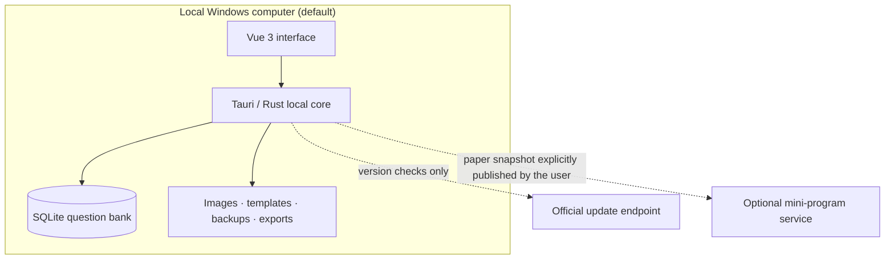

<p align="center">
  
</p>

# BCTK · TK Question Bank

**Build a local question bank from your teaching materials, then turn it into reusable exam papers.**

[](LICENSE)
[](#install-on-windows)
[](https://github.com/BBkjdayup/BCTK/tree/v0.1.88)
[](#architecture-and-data-boundaries)

<p align="center">
  <a href="README.md">简体中文</a> · <strong>English</strong>
</p>

BCTK (TK试题题库) is a Windows desktop application for teachers and educational organizations. It brings question editing, classification, paper assembly, page layout, document import/export, and backup into one workflow.

Question data is stored locally in SQLite. Since v0.1.85, all local desktop features are free to use without registration, activation, a license, or renewal. Optional mini-program publishing requires an online account and compatible service permissions.

Built with **Tauri 2, Vue 3, TypeScript, Rust, and SQLite**. Original source code is available under the **MIT License**. The application interface is currently in Chinese.

**[Download for Windows](https://tktiku.cn/#download)** · [View the v0.1.88 source tag](https://github.com/BBkjdayup/BCTK/tree/v0.1.88) · [Run from source](#run-from-source) · [Report an issue](https://github.com/BBkjdayup/BCTK/issues)

## Workflow at a glance



The default workflow stays on the local computer. Selected paper content is sent to a compatible service only when the user explicitly uses mini-program publishing.

## Screenshots

<p align="center">
  
</p>
<p align="center"><sub>Question-bank management: classify, search, preview, and edit</sub></p>

<table>
  <tr>
    <td width="50%"></td>
    <td width="50%"></td>
  </tr>
  <tr>
    <td align="center"><strong>Paper assembly</strong><br><sub>Filter candidates and adjust selected questions</sub></td>
    <td align="center"><strong>Page layout</strong><br><sub>Edit title, content, paper settings, templates, and Word output</sub></td>
  </tr>
</table>

The screenshots were captured from the v0.1.83 browser demo; v0.1.88 keeps the same core workspace. The demo uses built-in sample questions and does not access real question-bank files.

## Start here

| Goal | Entry point |
| --- | --- |
| Install the Windows application | [Official download](https://tktiku.cn/#download) |
| Explore or develop from source | [Run from source](#run-from-source) |
| Understand repository boundaries | [Repository scope](#repository-scope) |
| Report a problem or suggest a feature | [GitHub Issues](https://github.com/BBkjdayup/BCTK/issues) |

## Features

| Workflow | Capabilities |
| --- | --- |
| Capture questions | Multiple question types, answers and explanations, rich text, images, tables, and math formulas |
| Organize a collection | Subjects, chapters, tags, search, filters, batch editing, and duplicate checks |
| Import materials | Word `.docx` and Excel `.xlsx`, with per-question review and duplicate handling |
| Assemble papers | Manual selection, filtered random selection, question replacement, and reordering |
| Prepare output | Paginated editing, templates, saved layouts, Word/Excel export, and system printing |
| Protect local data | Drafts, paper history, snapshots, recycle bin, `.tqb` backups, safe restore, and data migration |
| Optional mobile workflow | Publish selected saved papers, manage invite codes and members, and review cross-device publications through a compatible service |

Word documents are read and generated by local Rust modules without automating Microsoft Office, WPS Office, or LibreOffice. Complex documents still have compatibility limits, including nested tables, externally linked images, and some formula or raw OOXML content.

## Install on Windows

The supported and primarily tested platform is **Windows 10 / 11 x64**.

1. Open the [official download page](https://tktiku.cn/#download).
2. Download the current Windows installer.
3. Follow the Chinese installation wizard and launch **TK试题题库**.

GitHub's automatic **Source code** archives are not desktop installers. The official installer currently has no Windows Authenticode signature and may appear as an unknown publisher; application updates use a separate Tauri Updater signature.

## Run from source

For the browser demo, install Node.js (24.x recommended) and pnpm 11.16.0. The desktop application additionally requires Rust stable with the MSVC toolchain, Visual Studio 2022 Build Tools with the C++ desktop workload, and WebView2.

```powershell
git clone https://github.com/BBkjdayup/BCTK.git
cd BCTK
npm install --global pnpm@11.16.0
pnpm install --frozen-lockfile

# Browser demo with sample data
pnpm dev

# Native Windows desktop application
pnpm tauri dev
```

Build a local Windows installer without the official updater private key:

```powershell
pnpm build:installer
```

Output: `src-tauri/target/release/bundle/nsis/`.

Before independently distributing a modified build, configure your own application identifier, branding, service endpoints, update channel, and signing keys. See [open-source build notes](docs/open-source.md).

## Development checks

```powershell
pnpm version:check
pnpm check
pnpm build
pnpm website:build
pnpm admin:build

cargo fmt --all --manifest-path src-tauri/Cargo.toml -- --check
cargo test --locked --manifest-path src-tauri/Cargo.toml --lib -- --test-threads=1
cargo clippy --locked --manifest-path src-tauri/Cargo.toml --all-targets -- -D warnings
```

Automated checks do not replace installation, printing, document compatibility, and backup/restore testing on Windows.

## Architecture and data boundaries



- The question bank, images, templates, backups, and exports remain in the local data directory by default.
- The retired question-bank cloud-sync feature was removed in v0.1.85; the application does not silently upload the local database.
- The application checks the official update endpoint for new versions.
- Optional mini-program features connect only after the user signs in and explicitly publishes a selected paper snapshot and supported resources.

## Repository scope

This repository contains the desktop client, product website, web-admin frontend, SQLite migrations, tests, and development documentation.

It does **not** contain the standalone cloud backend, the WeChat mini-program client, production deployment configuration, user data, private update-signing keys, or other production credentials. Optional online features require a compatible service and account permissions; the MIT source license does not include an operated service or subscription entitlement.

## Architecture

- **Vue 3 / Element Plus / Pinia:** interface and application state in `src/`.
- **Tauri 2 / Rust / SQLite:** desktop integration, local data, and document processing in `src-tauri/`.
- **Tiptap / KaTeX:** rich question editing and formula rendering.
- **canvas-editor:** paginated paper editing and printing.
- **`website/`:** product website and web-admin frontend source.

See the [Chinese documentation index](README.md#文档导航) for detailed architecture, installation, update, and data-safety notes.

## Contribute

Useful contributions include reproducible import/export examples, formula and table fixes, teaching workflow feedback, tests, and clearer documentation. Please read [CONTRIBUTING.md](CONTRIBUTING.md), or open an [issue](https://github.com/BBkjdayup/BCTK/issues). Use [SECURITY.md](SECURITY.md) for security reports.

## License

[MIT License](LICENSE) · Copyright (c) 2026 BBkjdayup
