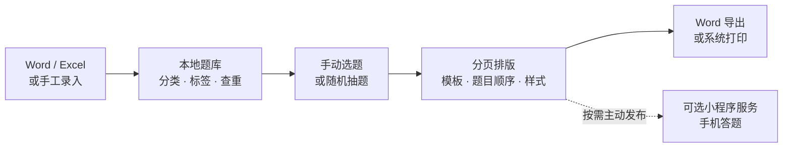
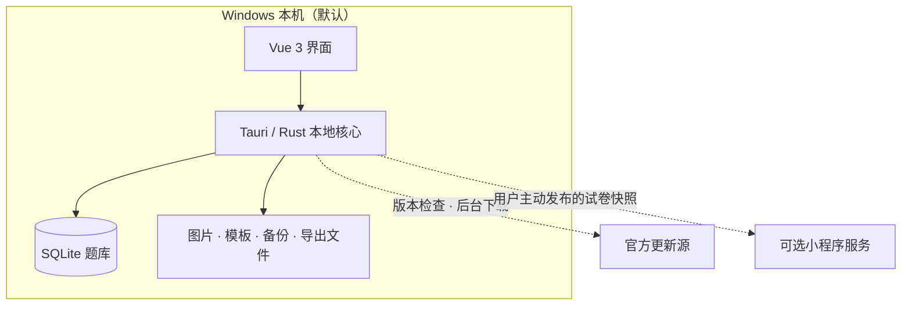

<p align="center">
  
</p>

# BCTK · TK试题题库

**把散落在文档里的题目，整理成自己的本地题库。**

[](LICENSE)
[](#获取与使用)
[](https://github.com/BBkjdayup/BCTK/tree/v0.1.94)
[](#技术组成与目录)

<p align="center">
  <strong>简体中文</strong> · <a href="README.en.md">English</a>
</p>

TK试题题库是一款面向教师个人和教育机构的 Windows 桌面软件。从题目录入、分类检索，到选题组卷、分页排版、导入导出和备份恢复，让日常积累的题目可以反复使用。

题库默认保存在自己的电脑上。自 v0.1.85 起，桌面本地功能免费开放，不需要注册、激活、许可证或续费；可选的小程序发布功能需要联网账号及相应服务权限。

项目基于 **Tauri 2 + Vue 3 + TypeScript + Rust + SQLite** 构建，源码采用 **MIT 许可证**。

**[下载 Windows 正式版](https://tktiku.cn/#download)** · [查看 v0.1.94 源码](https://github.com/BBkjdayup/BCTK/tree/v0.1.94) · [从源码运行](#从源码运行) · [反馈问题](https://github.com/BBkjdayup/BCTK/issues)

v0.1.94 源码汇总了近期的 Word / MathType 导入兼容修复、更新流程改进，以及小程序免费名额显示修复。详情见 [v0.1.94 源码说明](docs/releases/v0.1.94.md)；官网安装包版本以[下载页面](https://tktiku.cn/#download)为准。

## 一图了解使用流程



默认工作流全部在本机完成；只有用户主动使用小程序发布功能时，选定的试卷内容才会发送到配套服务。

## 界面预览

<p align="center">
  
</p>
<p align="center"><sub>题库管理：分类、检索、预览与编辑</sub></p>

<table>
  <tr>
    <td width="50%"></td>
    <td width="50%"></td>
  </tr>
  <tr>
    <td align="center"><strong>选题组卷</strong><br><sub>筛选候选题目，调整已选内容与顺序</sub></td>
    <td align="center"><strong>分页排版</strong><br><sub>编辑标题、正文、纸张、模板并导出 Word</sub></td>
  </tr>
</table>

截图来自 v0.1.83 浏览器演示模式，使用内置示例题；v0.1.94 的实际界面可能有所变化。演示模式不读写真实题库，文件导入导出、备份恢复等操作需要桌面版。

## 从这里开始

| 你想做什么 | 入口 |
| --- | --- |
| 下载软件，整理自己的题库 | [Windows 正式版](https://tktiku.cn/#download) · [安装与首次使用](docs/Windows安装与首次使用.md) |
| 了解能处理哪些教学资料 | [功能介绍](#功能介绍) · [文件兼容说明](#文件兼容说明) |
| 运行源码或预览界面 | [开发环境与启动步骤](#从源码运行) |
| 反馈教学需求或参与开发 | [提交 Issue](https://github.com/BBkjdayup/BCTK/issues) · [贡献指南](CONTRIBUTING.md) |

如果这个项目对你有用，欢迎点一下右上角的 **Star**；使用反馈和可复现的最小示例也能帮助项目改进。

## 功能介绍

| 场景 | 支持的功能 |
| --- | --- |
| 录入与编辑 | 单选、多选、填空、判断、简答及自定义题型；题干、选项、答案和解析；图片、表格、数学公式、上下标与富文本编辑 |
| 整理题库 | 按学科、章节和标签分类；搜索筛选、批量编辑、题目预览、使用状态筛选和重复题检测 |
| 批量导入 | 从 Word `.docx` 和 Excel `.xlsx` 导入；逐题审查、分类调整、重复项处理及可恢复草稿 |
| 选题组卷 | 手动选题与随机抽题；按学科、章节、标签和使用状态限定候选；支持多学科抽题、题目替换与排序 |
| 排版与打印 | 真实分页编辑、试卷模板、图片与表格、分页符、撤销重做、缩放、排版保存和系统打印 |
| 文档导出 | 将题库或已保存试卷导出为 Word；将题库导出为 Excel；Word 支持受管图片、表格及可编辑数学公式 |
| 历史与统计 | 试卷草稿、历史试卷、题目快照、题库统计、近期新增和使用情况 |
| 数据管理 | 回收站、`.tqb` 完整备份、备份校验、安全恢复和数据目录迁移 |
| 可选小程序协作 | 登录在线账号后发布已保存试卷、管理邀请码与成员、查看跨电脑发布记录；需要配套服务与套餐权限 |

Word 文档由本机 Rust 模块读取和生成，无需自动调用 Microsoft Office、WPS Office 或 LibreOffice。

### 一份试卷的制作流程

1. **建立分类**：整理学科、章节和标签，形成适合教学进度的题库结构。
2. **积累题目**：手动录入，或导入已有 Word / Excel 资料，核对题干、答案和解析。
3. **筛选与组卷**：手动选择题目，或按条件随机抽取，再调整顺序和替换题目。
4. **排版与输出**：选择模板、编辑分页稿，保存试卷并导出 Word 或打印。
5. **保留与备份**：从历史试卷继续编辑或复制，定期创建题库备份。
6. **按需发布**：需要学员手机答题时，再把选定试卷明确发布到配套小程序服务。

## 获取与使用

### Windows 用户

当前主要支持 **Windows 10 / 11 x64**。

1. 打开 [TK试题题库官网](https://tktiku.cn/#download)。
2. 下载当前 Windows 安装包并按中文向导安装。
3. 启动“TK试题题库”，建立分类并尝试录入、筛选和组卷。

GitHub 自动生成的 **Source code** 压缩包是源码，不能直接作为桌面程序运行。安装包目前没有 Windows Authenticode 代码签名，Windows 可能显示“未知发布者”；软件自动更新使用独立的 Tauri Updater 签名校验。

安装程序默认仅为当前 Windows 用户安装。若电脑缺少 WebView2，安装时会联网下载运行环境；因此，本地功能可离线使用不代表首次安装在所有电脑上都完全离线。

### 文件兼容说明

| 文件类型 | 当前范围 |
| --- | --- |
| Word `.docx` | 支持题目导入和文档导出；复杂内容需要在导入审查中核对 |
| Excel `.xlsx` | 导入文字和值；公式单元格读取文件中保存的显示值，不执行公式；支持题库导出 |
| Excel `.xls` / `.xlsm` | 需先另存为 `.xlsx` 再导入 |
| `.tqb` | 软件完整备份格式，用于备份校验与恢复 |

Word 导出暂不支持嵌套表格、外链图片、缺少 LaTeX 数据的公式节点及未经结构化转换的原始 OOXML；遇到不支持的内容会给出位置提示。Excel 导入不包含浮动图片和复杂公式对象。

## 从源码运行

### 1. 准备开发环境

| 工具 | 要求与用途 |
| --- | --- |
| Git | 获取源码 |
| Node.js | 推荐 24.x |
| pnpm | 11.16.0，已在 `package.json` 中固定 |
| Rust | stable，Windows 使用 MSVC 工具链 |
| Visual Studio 2022 Build Tools | 勾选“使用 C++ 的桌面开发” |
| Microsoft Edge WebView2 Runtime | 运行桌面界面 |

仅预览前端界面时，需要 Node.js 和 pnpm；运行真实桌面程序还需要 Rust、C++ 构建工具和 WebView2。

### 2. 获取源码并安装依赖

```powershell
git clone https://github.com/BBkjdayup/BCTK.git
cd BCTK
npm install --global pnpm@11.16.0
pnpm install --frozen-lockfile
```

### 3. 启动应用

```powershell
# 浏览器演示模式，不读写真实题库
pnpm dev

# 真实 Windows 桌面窗口
pnpm tauri dev
```

### 4. 构建普通 Windows 安装包

```powershell
pnpm build:installer
```

安装包输出到 `src-tauri/target/release/bundle/nsis/`。该命令关闭自动更新签名产物，不需要官方更新私钥。独立分发修改版前，请配置自己的应用标识、服务地址、更新公钥和品牌信息，避免与官方安装及数据混用。

## 检查与测试

```powershell
pnpm version:check
pnpm check
pnpm build
pnpm website:build
pnpm admin:build

cargo fmt --all --manifest-path src-tauri/Cargo.toml -- --check
cargo test --locked --manifest-path src-tauri/Cargo.toml --lib -- --test-threads=1
cargo clippy --locked --manifest-path src-tauri/Cargo.toml --all-targets -- -D warnings
```

自动化检查不能替代真实 Windows 环境中的安装、打印、文档兼容和备份恢复验收。请使用测试账户与合成题库验证会修改或删除数据的流程。

## 技术组成与目录

| 技术 | 主要用途 |
| --- | --- |
| Vue 3 / TypeScript / Element Plus / Pinia | 界面、交互与状态管理 |
| Tauri 2 / Rust | 桌面集成、本地业务、文件读写及文档处理 |
| SQLite | 本地题库、分类、草稿、试卷和设置 |
| Tiptap 3 / KaTeX | 富文本录题与数学公式显示 |
| canvas-editor | 试卷分页、排版编辑与打印 |
| Rust OOXML | Word 文档读取与生成、受支持内容的结构化转换 |

```text
BCTK/
├── src/                    # Vue 界面、状态管理、业务调用与前端测试
├── src-tauri/
│   ├── src/                # Rust 本地业务与后端测试
│   ├── migrations/         # SQLite 数据库迁移
│   └── tauri.conf.json     # 桌面窗口与打包配置
├── website/                # 官网与网页管理端前端源码
├── scripts/                # 版本检查、构建与验证脚本
├── docs/                   # 使用、架构和维护文档
├── CONTRIBUTING.md         # 贡献指南
├── SECURITY.md             # 安全问题报告方式
└── LICENSE                 # MIT 许可证
```

## 架构与数据边界



- 题库默认保存在本机 SQLite 数据库，不需要单独安装数据库服务器。
- 图片、模板、备份和导出文件由本地数据目录统一管理。
- 回收站到期只提醒，不会自动清空题目。
- 完整备份使用 `.tqb` 格式，包含版本化清单和文件摘要校验。
- 数据目录迁移采用“复制 → 校验 → 切换 → 保留原目录”的流程。
- 旧题库云同步功能已在 v0.1.85 退役；本地题库不会被后台整库上传。
- 软件会联网检查并在后台下载经过签名校验的官方更新。只有用户主动使用小程序功能时，才会登录配套服务并上传明确选择发布的试卷快照及其受支持资源。

## 常见问题

**桌面功能需要注册或付费吗？** 不需要。v0.1.85 及之后版本的本地录题、导入、组卷、导出、打印和备份功能免费使用。

**小程序功能也完全离线吗？** 不是。小程序发布、成员管理和手机答题需要联网账号、配套云服务及相应套餐权限；它与桌面本地功能分开。

**支持 macOS、Linux 或网页版题库吗？** 当前安装包和主要验证环境为 Windows 10 / 11 x64。浏览器模式用于界面演示，不能替代桌面版的本地文件能力。

**导出的 Word 和预览会完全一样吗？** 两者使用不同的排版引擎，复杂字体、换行与页数可能存在差异，正式使用前应核对导出结果。

## 开源范围

本仓库包含桌面客户端、官网、网页管理端前端、SQLite 迁移、测试和开发文档，原创代码采用 [MIT 许可证](LICENSE)。第三方组件保留各自版权和许可，见 [THIRD_PARTY_NOTICES.md](THIRD_PARTY_NOTICES.md)。

本仓库不包含独立云服务端、微信小程序客户端、生产部署配置、真实用户数据、更新签名私钥或其他生产凭据。可选在线功能需要兼容服务与账号权限；MIT 源码许可不等于提供运营中的在线服务或套餐。

修改版如需独立分发，应使用自己的应用标识、服务配置、更新渠道与密钥，不应将修改版标示为本项目的官方发布。详见 [开源范围与构建说明](docs/open-source.md)。

## 文档导航

| 文档 | 内容 |
| --- | --- |
| [Windows 安装与首次使用](docs/Windows安装与首次使用.md) | 安装、数据目录与卸载说明 |
| [技术方案说明](docs/技术方案说明.md) | 面向非技术人员的技术选型解释 |
| [编辑器与组卷架构](docs/编辑器与组卷架构.md) | 录题、排版、兼容和导出边界 |
| [免费离线版说明](docs/free-offline-v0.1.85.md) | 免费桌面功能与退役功能 |
| [开源范围与构建说明](docs/open-source.md) | 仓库范围、本地构建与修改版分发 |
| [自动更新说明](docs/automatic-updates.md) | 官方更新行为与签名边界 |
| [试卷归档安全](docs/paper-archive-safety.md) | 历史试卷保存与覆盖保护 |
| [变更日志](CHANGELOG.md) | 各版本对用户可见的变化 |

## 参与贡献

欢迎教师提供真实教学需求，也欢迎开发者改进功能、修复问题、补充测试和完善文档。

- 使用问题与功能建议：提交 [Issue](https://github.com/BBkjdayup/BCTK/issues)。
- 代码与文档改进：阅读 [贡献指南](CONTRIBUTING.md) 后提交 Pull Request。
- 安全问题：按 [安全报告说明](SECURITY.md) 联系维护者，避免公开真实题库、账号信息或未处理的漏洞细节。

## 许可证

[MIT License](LICENSE) · Copyright (c) 2026 BBkjdayup
